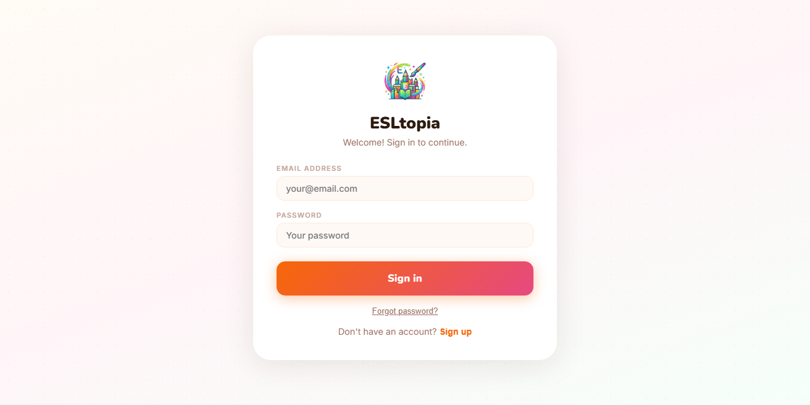
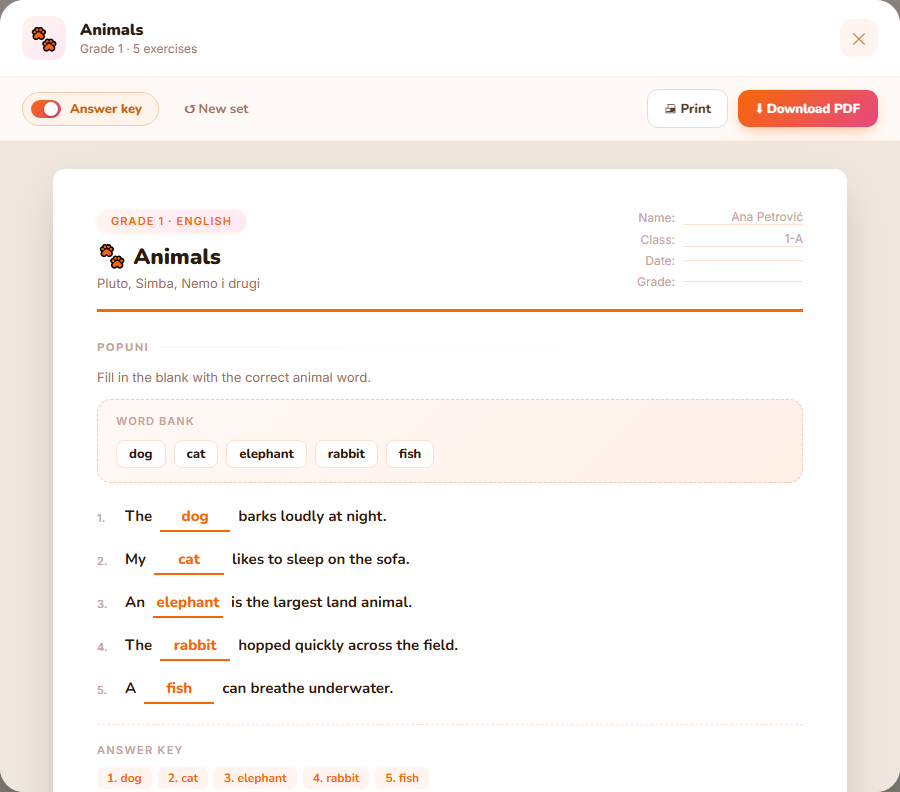

# ESLtopia

[](https://github.com/JovovicMiljan89/ESLtopia/actions/workflows/daily-tests.yml) · [📊 View latest test report](https://jovovicmiljan89.github.io/ESLtopia/)

English worksheet and lesson-content generator for teachers and language schools, with a randomized template engine covering 24 topics across grades 1–6.

Built with React + Vite, Supabase (auth, database, edge functions), and deployed on Vercel.

**Live app:** [esltopia.vercel.app](https://esltopia.vercel.app) · **QA docs:** [test plan, test cases, scenario checklist](docs/qa/)

<p align="center">
  
  &nbsp;
  
</p>

## Features

- Randomized worksheets and exercises from a curated content bank (match, fill-in, true/false, listen & circle, color boxes)
- Class and student management — create classes, add/remove students
- Attendance, payment, and grade tracking per student per class
- Student profile modal with trimester summaries
- Role-based access: **Teacher**, **School** (manages teachers), **Superadmin**
- School admins can invite, deactivate, and remove their teachers
- Password recovery flow via email
- Pending/inactive account enforcement at login and session restore
- Superadmin dashboard — promote roles, delete accounts

## Tech stack

| Layer | Technology |
|---|---|
| Frontend | React 18, Vite |
| Auth & DB | Supabase (GoTrue, PostgreSQL, Edge Functions) |
| Hosting | Vercel |
| Tests | Playwright (E2E + API) |

## Local development

```bash
npm install
npm run dev        # starts Vite dev server at http://localhost:5173
```

Create `.env.local` and fill in:

```
VITE_SUPABASE_URL=
VITE_SUPABASE_ANON_KEY=
```

## Running tests

Tests run against the deployed production URL by default.

```bash
# one-time setup
npx playwright install chromium firefox webkit

# run everything (all 3 browsers)
npm test

# fast loop: Chromium only
npm run test:chromium

# just Firefox + WebKit
npm run test:cross-browser

# visual-regression suite only (baselines are Chromium/Linux-only — see docs/qa/)
npm run test:visual

# run with Playwright UI (watch mode)
npm run test:ui

# open the last HTML report
npm run test:report
```

Load testing (k6, against `login` and `records` write paths):

```bash
npm run loadtest:login
npm run loadtest:records
```

### Required env for tests

Create `.env.test.local` (git-ignored):

```
VITE_SUPABASE_URL=
VITE_SUPABASE_ANON_KEY=
SUPABASE_SERVICE_ROLE_KEY=   # needed to create/delete test users
```

`BASE_URL` defaults to `https://esltopia.vercel.app` — override to target a preview or local build.

Test users are created under the `@example.test` domain and purged automatically after each run.

### Feature-flagged tests

The school-teacher edge-function tests are skipped by default. Add to `.env.test.local`:

```
FEATURE_SCHOOL_TEACHERS=1
```

## Test coverage

**144 automated test cases across 15 spec files**, run against the live production app — not a local mock:

- **Cross-browser**: Chromium, Firefox, and WebKit, wired into CI and runnable individually (`npm run test:chromium` / `test:cross-browser`)
- **Security-first**: RLS/privilege-escalation coverage for every role boundary and table — cross-teacher data isolation on read *and* write (forged `owner_id` on insert), self-promotion to superadmin blocked, cascade deletes verified end-to-end
- **Visual regression**: pixel-diff snapshots of 4 key screens (`toHaveScreenshot`, 2% tolerance), Chromium/Linux baselines refreshed via a dedicated CI workflow
- **XSS/HTML-injection resilience**: explicit `<script>`/`` injection tests on every free-text field (class names, student names, notes)
- **Rate-limit behavior**: burst tests against the login and password-recovery endpoints, documenting actual production behavior rather than assuming it
- **Load testing**: k6 scripts for the login and record-write paths (`npm run loadtest:login` / `loadtest:records`)
- Full QA paper trail: a versioned [Master Test Plan](docs/qa/test-plan.pdf), [Test Case Specification](docs/qa/test-cases.pdf), and [Scenario Coverage Checklist](docs/qa/test-scenarios.pdf) — each with a revision history tracking exactly what changed and why — plus a standing, prioritized [test coverage TODO](docs/qa/test-coverage-todo.md) for what isn't covered yet

| Spec | What it covers |
|---|---|
| `login.spec.ts` | UI login, password/email validation, API token grant (password + refresh), rate-limit burst behavior |
| `registration.spec.ts` | UI signup (teacher + school), form validation, API signup, DB trigger role defaults, anti-enumeration |
| `logout.spec.ts` | UI sign-out, API logout, session invalidation |
| `forgot-password.spec.ts` | UI forgot-password form, API recover endpoint, rate-limit burst behavior |
| `password-reset.spec.ts` | Recovery link flow, validation, single-use enforcement |
| `roles.spec.ts` | Superadmin coercion, admin portal access, account status restrictions, JWT claims, privilege escalation via REST |
| `navigation.spec.ts` | Auth guards, session persistence across reload, deactivated-account eviction |
| `superadmin.spec.ts` | Admin tab access, profile read/update/delete RLS, role promotion, Admin panel UI |
| `school-teachers.spec.ts` | School creates/manages/removes teachers, edge-function error handling |
| `classes.spec.ts` | Classes & records CRUD, student management, RLS isolation (read/delete *and* insert-forgery), cascade delete, superadmin full access |
| `classes-ui.spec.ts` | Classes tab UI click-through — create/roster add-remove/delete via the real form; XSS resilience in class and student names |
| `profile.spec.ts` | Profile self-update (name fields), trigger protection (role change blocked), cross-user RLS |
| `records.spec.ts` | Records tab UI — attendance/grade/payment toggles, student profile modal, persistence across reload, failed-save handling, XSS resilience in notes |
| `pdf-modal.spec.ts` | PDF preview modal — open/close (button + Escape), answer-key toggle, "New set" regeneration |
| `visual-regression.spec.ts` | Pixel-diff snapshots of the login screen, dashboard, worksheet generator settings, and PDF modal |

## Database schema

Three core tables, all with Row Level Security:

- **`profiles`** — id, first/last/middle name, email, role, status, school_id
- **`classes`** — id (text PK), name, owner_id, students (jsonb array)
- **`records`** — class_id (PK, cascades from classes), owner_id, data (jsonb: attendance/payment/grades/notes)

`classes.owner_id` and `records.owner_id` both `on delete cascade` from `auth.users` — deleting a user (e.g. a school removing a teacher) permanently deletes every class and record they own, not just their profile. See `docs/qa/test-scenarios.pdf` §5 for the test that verifies this.

Migrations live in `supabase/migrations/`.

## Deployment

Deploys are **not** automatic on push — pushing to `main` only updates the git history. To ship a frontend change:

```bash
git push origin main   # source of truth, but does not trigger a build
vercel --prod --yes    # actually deploys to https://esltopia.vercel.app
```

Verify the deploy landed by checking that the bundle hash changed:

```bash
curl -s https://esltopia.vercel.app/ | grep -o 'assets/index-[A-Za-z0-9]*\.js'
```

Database/edge-function changes are deployed separately via the Supabase CLI (`supabase db push`, `supabase functions deploy`).

## CI

GitHub Actions runs two scheduled workflows:

- **daily-tests** — full Playwright suite (Chromium, Firefox, WebKit) against production every day at 13:00 UTC
- **daily-registrations** — new-user report emailed every day at 09:00 UTC

## License

[MIT](LICENSE)
